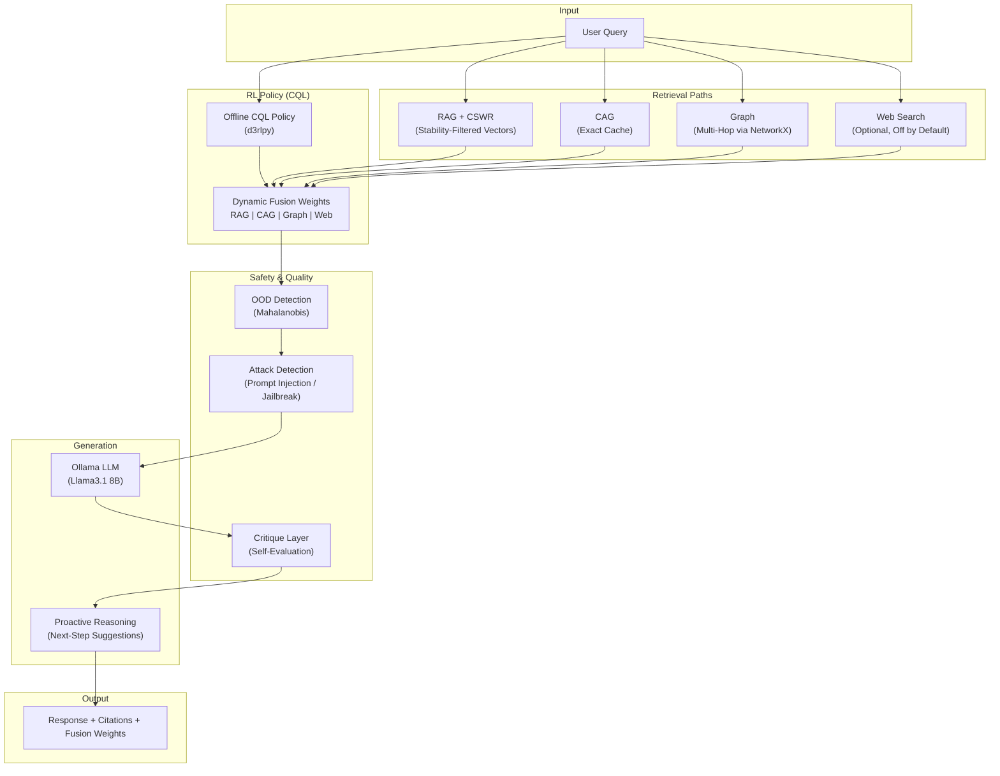

# RLFusion Orchestrator

A local-first system I built after getting fed up with assistants drifting, forgetting context, or changing behavior every time a cloud update rolled through. It blends multiple retrieval paths, scores how each one behaves, and uses offline RL to decide the weight mix for every query. What started as a personal tool slowly turned into something far more capable.

**Author:** Bradley R. Kinnard
**LinkedIn:** https://www.linkedin.com/in/brad-kinnard/

**License:** [MIT](LICENSE)
If you use this work in your own project, research, or write-up, please cite this repo and my LinkedIn above.

---

## What This Actually Is

This isn't a "better RAG pipeline". It behaves closer to a local cognitive engine that controls how it retrieves, filters, evaluates, and routes information.

It uses four retrieval paths, a stability filter, a safety layer, a critique layer, and an RL policy that adapts slowly over time. The whole pipeline is transparent. You can watch the weights shift in the UI. Nothing is hidden and nothing leaves your machine.

It runs on consumer hardware with Llama3.1 8B through Ollama and stays consistent regardless of outside changes.

---

## Why I Built It

Assistants drift. They hallucinate. They forget what you just told them. Some of them throw different answers depending on the day of the week. I wanted something stable and private that I could actually trust.

To get that, I had to build:

- multiple retrieval paths
- a stability filter that kills noisy chunks
- a safety and critique layer
- an offline CQL router that won't thrash
- a proactive reasoning pass
- and a full stress test suite to validate behavior across thousands of iterations

This system wasn't built to look impressive. It was built to stay stable and sane.

---

## Architecture



### Data Flow Summary

1. **Query enters** — routed to all four retrieval paths simultaneously.
2. **CQL policy** evaluates the query embedding and outputs fusion weights (how much to trust each path).
3. **CSWR** filters RAG results using entropy scoring, embedding variance, and contradiction checks — anything below 0.7 stability is removed.
4. **Fusion** merges results weighted by the CQL policy output.
5. **OOD detection** (Mahalanobis) flags out-of-distribution queries before they can destabilize the response.
6. **Attack detection** screens for prompt injection and jailbreak attempts.
7. **LLM generates** a response grounded in the fused context.
8. **Critique layer** self-evaluates the response for quality and safety.
9. **Proactive reasoning** suggests follow-up steps when useful.
10. **Response** is delivered with full transparency — fusion weights, reward scores, and citations visible in the UI.

---

## What It Does

RLFusion runs four retrieval paths that each fill a different role.

### RAG + CSWR

Standard RAG pulls garbage. CSWR filters it using entropy scoring, embedding variance, and basic contradiction checks. Anything below 0.7 stability gets removed or down-weighted. This cuts hallucinations in a noticeable way.

### CAG

A fast, explicit cache for information I want preserved exactly. No interpretation. No drift. Just "store this and don't screw it up".

### Graph

NetworkX for multi-hop reasoning when the query depends on relationships instead of surface text.

### Web

Optional and off by default. Used only if local context genuinely isn't enough. Requires a [Tavily API key](https://tavily.com).

The RL policy (CQL) adjusts retrieval weights per query based on real usage logs. It adapts slowly to avoid behavior swings. The result is predictable routing instead of guesswork.

The system also includes:

- proactive reasoning for next-step suggestions
- citation tracking
- a critique-based safety pass
- Mahalanobis OOD checks to catch out-of-distribution queries

---

## Quick Start

### Requirements

- Python 3.10+
- [Ollama](https://ollama.ai) with `llama3.1:8b-instruct-q4_0` pulled
- Node.js 18+ (for the frontend, optional)
- CUDA GPU optional but helps with embeddings

### Setup

```bash
git clone https://github.com/moonrunnerkc/rlfusion-orchestrator.git
cd rlfusion-orchestrator

python -m venv venv
source venv/bin/activate
pip install -r backend/requirements.txt

cp .env.example .env
./scripts/init_db.sh
```

### Run the Backend

```bash
uvicorn backend.main:app --port 8000
```

Once running, the interactive API documentation is available at:
- **Swagger UI:** [http://localhost:8000/docs](http://localhost:8000/docs)
- **ReDoc:** [http://localhost:8000/redoc](http://localhost:8000/redoc)

### Frontend (Optional)

```bash
cd frontend
npm install
npm run dev
```

The UI will be available at [http://localhost:5173](http://localhost:5173).

### RL Training (Optional)

```bash
python backend/rl/train_rl.py
```

---

## Environment Variables

All configurable environment variables are documented in `.env.example`:

| Variable | Required | Default | Description |
|----------|----------|---------|-------------|
| `TAVILY_API_KEY` | No | _(empty)_ | Tavily API key for web search. Only needed if `web.enabled: true` in config. Get a free key at [tavily.com](https://tavily.com). |
| `RLFUSION_DEVICE` | No | `cpu` | Compute device: `cpu` or `cuda`. |
| `RLFUSION_FORCE_CPU` | No | `false` | Set to `true` to force CPU mode even if CUDA is available. |
| `OLLAMA_HOST` | No | `http://localhost:11434` | Ollama server URL. Change if Ollama runs on a different host/port. |

Additional configuration is in `backend/config.yaml` — see the [Configuration](#configuration) section below.

---

## Core Pieces

### CSWR

Chunk Stability Weighted Retrieval. Uses entropy, variance, and contradiction checks to keep unstable chunks out of the pipeline.

### RL Routing (CQL)

The offline CQL policy evaluates reliability and adjusts path weights slowly and predictably. Keeps the system from doing mood swings or reward shortcuts.

### Safety and OOD

A lightweight classifier handles dangerous queries. Mahalanobis scoring flags unusual input before it destabilizes the response.

### Proactive Layer

Predicts the next likely steps and offers them when useful. Adds flow without getting in the way.

---

## Configuration

`backend/config.yaml`:

```yaml
llm:
  model: llama3.1:8b-instruct-q4_0
  host: http://localhost:11434
  temperature: 0.72
  max_tokens: 4096

embedding:
  model: all-MiniLM-L6-v2
  device: cpu           # "cpu" or "cuda"

rl:
  policy_path: models/rl_policy_cql.d3

web:
  enabled: false        # Enable to allow web search (requires TAVILY_API_KEY)
  max_results: 3
  search_timeout: 10
```

---

## Project Structure

```
backend/
  main.py              — FastAPI entry point
  config.py            — Configuration loader
  config.yaml          — Default configuration
  core/                — Core retrieval, fusion, critique logic
  rl/                  — Reinforcement learning training scripts
frontend/
  src/                 — React UI (Vite + Tailwind)
models/
  rl_policy_cql.d3     — Pre-trained CQL policy (~3.3 MB)
scripts/
  init_db.sh           — Database initialization
  compatibility/
    fix_blackwell.sh   — NVIDIA Blackwell (RTX 50-series) CUDA fix
tests/                 — Test suites (API, GPU, load testing)
training/              — Training orchestration scripts
```

### Hardware Compatibility

**NVIDIA Blackwell GPUs (RTX 50-series):** If you encounter cuBLAS errors on Blackwell architecture GPUs, run the compatibility fix:

```bash
source venv/bin/activate
./scripts/compatibility/fix_blackwell.sh
```

This installs PyTorch nightly builds with proper Blackwell support. See the script header for details. This is only needed for RTX 5070/5080/5090 or similar Blackwell-based cards.

---

## Benchmarks

Ran on an RTX 5070 with Llama3.1 8B. Six full suites. All passed.

| Suite | Iterations | Pass | Highlights | Avg Latency |
|-------|-----------|------|------------|-------------|
| hallucination | 500 | Yes | no crashes; stable filtering | ~11.2s |
| proactive | 500 | Yes | 1.0 anticipation_rate, 0.936 coherence | ~10.2s |
| adversarial | 500 | Yes | 1.0 robustness, 0.65 jailbreak resist | ~9.7s |
| evolution | 500 | Yes | 1.0 drift resistance, 0.965 stability | ~10.0s |
| extensibility | 500 | Yes | 0.97 weight stability | ~10.1s |
| ethics_and_bias | 500 | Yes | 1.0 safety, fairness ≥ 0.983 | ~10.0s |

**Overall pass rate:** 100 percent

---

## API Endpoints

| Method | Path | Description |
|--------|------|-------------|
| `POST` | `/chat` | Send a query and receive a fused response with weights and reward. |
| `WS` | `/ws` | WebSocket endpoint for streaming chat with real-time fusion weights. |
| `GET` | `/api/config` | Get current configuration (web search status, etc.). |
| `PATCH` | `/api/config` | Update configuration at runtime (e.g., toggle web search). |
| `GET` | `/ping` | Health check — returns GPU status and policy availability. |

Full interactive documentation is auto-generated by FastAPI at `/docs` when the server is running.

---

## Contributing

See [CONTRIBUTING.md](CONTRIBUTING.md) for development setup, coding standards, and pull request guidelines.

## Security

See [SECURITY.md](SECURITY.md) for vulnerability reporting instructions. **Do not open public issues for security vulnerabilities.**

## Code of Conduct

See [CODE_OF_CONDUCT.md](CODE_OF_CONDUCT.md).

## License

[MIT](LICENSE) — Copyright (c) 2025 Bradley R. Kinnard
