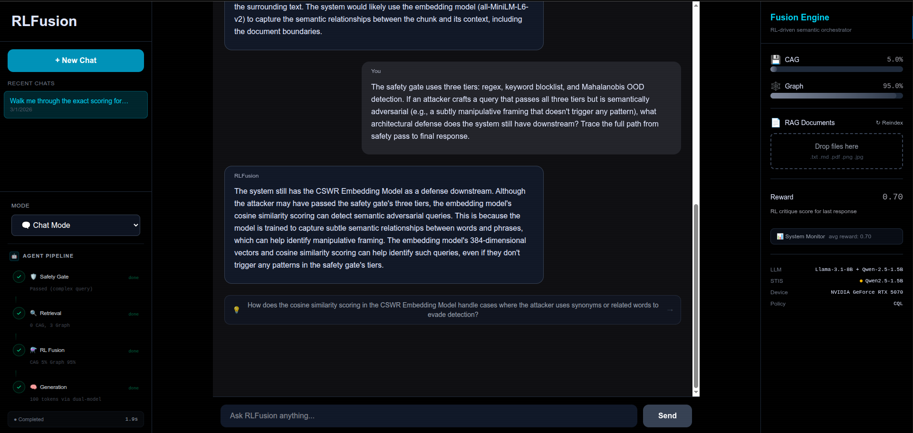
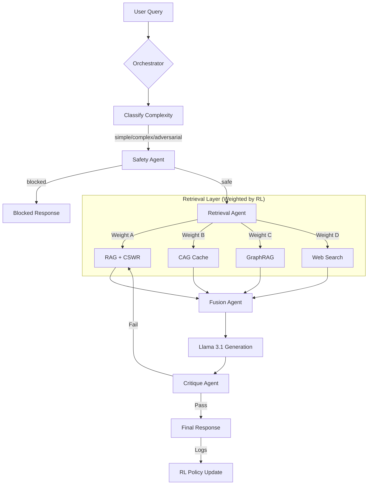

# RLFusion Orchestrator

A local-first system I built after getting fed up with assistants drifting, forgetting context, or changing behavior every time a cloud update rolled through. It blends multiple retrieval paths, scores how each one behaves, and uses offline RL to decide the weight mix for every query. What started as a personal tool slowly turned into something far more capable.

**Author:** Bradley R. Kinnard
**LinkedIn:** https://www.linkedin.com/in/brad-kinnard/

**License:** [MIT](LICENSE)
**Whitepaper:** [WHITEPAPER.md](WHITEPAPER.md) - full technical write-up covering CSWR, CQL routing, self-critique rewards, and benchmark results.

If you use this work in your own project, research, or write-up, please cite this repo and my LinkedIn above.



---

## What This Actually Is

This isn't a "better RAG pipeline". It behaves closer to a local cognitive engine that controls how it retrieves, filters, evaluates, and routes information.

It uses four retrieval paths, a stability filter, a safety layer, a critique layer, and an RL policy that adapts slowly over time. The whole pipeline is transparent. You can watch the weights shift in the UI. Nothing is hidden and nothing leaves your machine.

The system is organized as a multi-agent pipeline where specialized agents handle retrieval, fusion, critique, and safety as independent, composable units. An orchestrator classifies query complexity and routes through the appropriate agent chain (`backend/agents/orchestrator.py::classify_complexity`).

It runs on consumer hardware with Llama3.1 8B through Ollama and stays consistent regardless of outside changes.

---

## Why I Built It

Assistants drift. They hallucinate. They forget what you just told them. Some of them throw different answers depending on the day of the week. I wanted something stable and private that I could actually trust.

To get that, I had to build:

- multiple retrieval paths with graph-aware hybrid search
- a stability filter that kills noisy chunks
- a safety and critique layer with tree-structured reasoning
- an offline CQL router (with online PPO and DPO training options) that won't thrash
- a proactive reasoning pass
- a dynamic tool system for calculators, code execution, and API calls
- hardware-aware scheduling and federated policy updates
- ground-truth benchmark evaluation
- and a full stress test suite to validate behavior across thousands of iterations

This system wasn't built to look impressive. It was built to stay stable and sane.

---

## Architecture



### Data Flow Summary

1. **Query enters** the orchestrator, which classifies complexity as simple, complex, or adversarial (`backend/agents/orchestrator.py::classify_complexity`).
2. **Safety agent** screens for prompt injection, jailbreaks, and OOD input. Adversarial queries hit this gate first and can be blocked before retrieval starts (`backend/agents/safety_agent.py`).
3. **Retrieval agent** dispatches to all four retrieval paths. Depth scales with query complexity (`backend/agents/retrieval_agent.py`).
4. **CQL/PPO/DPO policy** evaluates the query embedding and outputs fusion weights (`backend/agents/fusion_agent.py::compute_rl_weights`).
5. **CSWR** filters RAG results using neighbor cosine similarity (local stability), question-fit scoring, and drift penalty. Chunks below the domain-specific stability threshold (0.7 general, 0.65 tech, 0.55 code) are down-weighted (`backend/core/retrievers.py::score_chunks`).
6. **Graph engine** provides entity resolution, Leiden community detection, and multi-hop traversal for structured context (`backend/core/graph_engine.py`).
7. **Fusion agent** merges results weighted by the RL policy output.
8. **LLM generates** a response grounded in the fused context.
9. **Critique agent** self-evaluates the response for factual accuracy, helpfulness, and citation coverage, with optional tree-structured ORPS reasoning for high-sensitivity queries (`backend/core/reasoning.py`).
10. **Response** is delivered with full transparency: fusion weights, reward scores, and citations visible in the UI.

---

## What It Does

RLFusion runs four retrieval paths that each fill a different role.

### RAG + CSWR

Standard RAG pulls garbage. CSWR filters it by scoring each chunk on three axes: local stability (cosine similarity to neighboring chunks), question fit (entity and intent overlap with the query profile), and drift penalty (detects topic shifts that break coherence). Chunks below the domain-specific stability threshold get removed or down-weighted. This cuts hallucinations in a noticeable way.

Tested in `tests/test_core_units.py` (TestScoreChunks, TestComputeStability, TestComputeFit, TestComputeDrift, TestBuildPack).

### CAG

A fast, explicit cache for information I want preserved exactly. No interpretation. No drift. Just "store this and don't screw it up". Semantic matching uses batch-embedded keys for sub-50ms lookups even with hundreds of cached entries.

### GraphRAG

NetworkX-based knowledge graph with entity resolution (deduplication via embedding similarity), Leiden community detection (via igraph/leidenalg when available), and multi-hop traversal for structured reasoning. The graph engine scores chunks on entity co-occurrence, community coherence, and path distance. Falls back to FAISS-only retrieval when the graph has insufficient coverage.

Implemented in `backend/core/graph_engine.py`. Tested in `tests/test_core_units.py` (TestResolveEntities, TestBuildEntityGraph, TestCommunitySummarize, TestComputeFitGraphAware).

### Web

Optional and off by default. Used only if local context genuinely isn't enough. Requires a [Tavily API key](https://tavily.com).

The RL policy (CQL/PPO/DPO) adjusts retrieval weights per query based on real usage logs. It adapts slowly to avoid behavior swings. The result is predictable routing instead of guesswork. An `AdaptivePolicy` (`backend/rl/train_ppo.py::AdaptivePolicy`) automatically transitions through three RL stages as interaction data accumulates.

The system also includes:

- proactive reasoning for next-step suggestions
- citation tracking
- a critique-based safety pass with optional tree-structured ORPS reasoning (`backend/core/reasoning.py`)
- Mahalanobis OOD checks to catch out-of-distribution queries (`backend/core/utils.py::check_query_ood`)
- conversation memory with entity extraction and anaphora resolution (`backend/core/memory.py`)
- dynamic tool dispatch: calculator, code executor, API bridge, web search (`backend/tools/`)
- model fine-tuning via LoRA SFT with GGUF export (`backend/rl/fine_tune.py`)
- MoE-style model routing per task type (`backend/core/model_router.py`)
- multi-modal image processing and retrieval (`backend/core/multimodal.py`)
- hardware-aware scheduling and federated policy updates (`backend/core/scheduler.py`, `backend/rl/federated.py`)
- Prometheus observability at `GET /metrics` with Grafana dashboard template

---

## Quick Start

### Requirements

- Python 3.10+
- [Ollama](https://ollama.ai) with `llama3.1:8b-instruct-q4_0` pulled
- Node.js 18+ (for the frontend, optional)
- CUDA GPU optional but helps with embeddings

### Setup

1. **Clone and prepare**

   ```bash
   git clone https://github.com/moonrunnerkc/rlfusion-orchestrator.git
   cd rlfusion-orchestrator

   python3 -m venv venv
   source venv/bin/activate  # On Windows: venv\Scripts\activate
   pip install -r backend/requirements.txt
   ```

2. **Initialize environment**

   ```bash
   cp .env.example .env
   ./scripts/init_db.sh
   ```

3. **Pull the required model**

   ```bash
   ollama pull llama3.1:8b-instruct-q4_0
   ```

4. **Add your documents**

   Drop `.txt`, `.md`, or `.pdf` files into the `data/docs/` directory. These are what the RAG retrieval path searches against. Subdirectories are scanned recursively.

   ```bash
   # example: copy your notes, manuals, research papers, anything
   cp ~/my-notes/*.md  data/docs/
   cp ~/papers/*.pdf   data/docs/
   ```

   The FAISS index is built automatically on first startup. If you add or remove documents later, trigger a rebuild without restarting the server:

   ```bash
   curl -X POST http://localhost:8000/api/reindex
   ```

   Or use the **Reindex Docs** button in the frontend sidebar.

   > **Supported formats:** `.txt`, `.md`, `.pdf`, `.png`, `.jpg`, `.svg` (images require optional multimodal dependencies)
   > **Chunking:** 400 tokens per chunk, embedded with BGE-small-en-v1.5 (384 dims)
   > **Index location:** `indexes/rag_index.faiss` (auto-generated, safe to delete and rebuild)

### Run the Backend

```bash
uvicorn backend.main:app --port 8000
```

Once running, the interactive API documentation is available at:
- **Swagger UI:** [http://localhost:8000/docs](http://localhost:8000/docs)
- **ReDoc:** [http://localhost:8000/redoc](http://localhost:8000/redoc)

### Frontend (Optional)

```bash
cd frontend
npm install
npm run dev
```

The UI will be available at [http://localhost:5173](http://localhost:5173).

### RL Training (Optional)

```bash
# Offline CQL (default, already pre-trained)
python backend/rl/train_rl.py

# Online PPO (after collecting interactions)
python backend/rl/train_ppo.py

# DPO (after collecting 500+ preference pairs)
python backend/rl/train_dpo.py
```

### What to Expect on a Fresh Install

RLFusion ships with a pre-trained CQL policy that provides reasonable defaults out of the box, but it genuinely improves with use.

The system learns from every interaction. Each query you send gets scored by the critique layer, and those scores feed back into the RL policy that controls how retrieval sources are weighted. The `AdaptivePolicy` transitions through three stages:

1. **CQL (interactions 0-50)**: Conservative offline policy. Stable but not personalized.
2. **PPO (interactions 50-500)**: Online fine-tuning begins. Weights start reflecting your usage patterns.
3. **DPO (500+)**: Preference-based optimization kicks in when enough comparison data exists.

After that warm-up window:

- Retrieval weights start reflecting what actually works for your queries
- The CAG cache builds up with high-quality answers the system has seen before
- Proactive suggestions become more relevant to your workflow
- The critique layer has enough signal to meaningfully differentiate good from bad responses

This is by design. The policy updates slowly and conservatively to avoid behavior swings. You won't notice a sudden shift. It just gradually gets better at knowing which retrieval path to trust for different types of questions.

If you want to accelerate the warm-up, you can batch-seed episodes:

```bash
python backend/rl/add_batch_episodes.py
python backend/rl/train_rl.py
```

---

## Environment Variables

All configurable environment variables are documented in `.env.example`:

| Variable | Required | Default | Description |
|----------|----------|---------|-------------|
| `TAVILY_API_KEY` | No | _(empty)_ | Tavily API key for web search. Only needed if `web.enabled: true` in config. Get a free key at [tavily.com](https://tavily.com). |
| `RLFUSION_DEVICE` | No | `cpu` | Compute device: `cpu` or `cuda`. |
| `RLFUSION_FORCE_CPU` | No | `false` | Set to `true` to force CPU mode even if CUDA is available. |
| `OLLAMA_HOST` | No | `http://localhost:11434` | Ollama server URL. Change if Ollama runs on a different host/port. |
| `RLFUSION_ADMIN_KEY` | No | _(empty)_ | Bearer token required for `POST /api/fine-tune`. If unset, fine-tuning endpoint rejects all requests. |

Additional configuration is in `backend/config.yaml`. See the [Configuration](#configuration) section below.

---

## Core Pieces

### CSWR

Chunk Stability Weighted Retrieval. Scores each chunk on local stability (neighbor embedding similarity), question fit (entity and intent matching), and drift penalty (cosine drop between adjacent chunks). Keeps unstable or off-topic chunks out of the pipeline.

Implemented in `backend/core/retrievers.py::score_chunks`. Config in `backend/config.yaml` under `cswr:`.

### RL Routing (CQL/PPO/DPO)

The CQL offline policy evaluates reliability and adjusts path weights slowly and predictably. PPO adds online adaptation after sufficient interactions. DPO refines weights based on preference pairs. The `AdaptivePolicy` (`backend/rl/train_ppo.py`) manages the transition between all three.

### Safety and OOD

A pattern-based safety gate screens queries for injection attempts, jailbreaks, and harmful content before retrieval even starts (`backend/agents/safety_agent.py`). Mahalanobis scoring (with Ledoit-Wolf shrinkage) flags unusual input before it destabilizes the response (`backend/core/utils.py::check_query_ood`).

### Proactive Layer

Predicts the next likely steps and offers them when useful. Adds flow without getting in the way.

---

## Configuration

`backend/config.yaml` controls all system behavior. Key sections:

```yaml
llm:
  model: llama3.1:8b-instruct-q4_0
  host: http://localhost:11434
  temperature: 0.72
  max_tokens: 4096

embedding:
  model: BAAI/bge-small-en-v1.5
  device: cuda

rl:
  policy_path: models/rl_policy_cql.d3
  ppo:                  # PPO hyperparameters
  dpo:                  # DPO hyperparameters
  adaptive_warmup:      # CQL->PPO->DPO transition thresholds
  grpo:                 # Group policy optimization settings

web:
  enabled: false
  max_results: 3
  search_timeout: 10

graph:
  enabled: true
  max_hops: 2
  entity_similarity_threshold: 0.75

reasoning:
  beam_width: 3
  prune_threshold: 0.3
  faithfulness_on_hot_path: true

tools:
  enabled: true
  max_calls_per_tool: 10

multimodal:
  enabled: false        # set true + install dependencies for image support

monitoring:
  prometheus_enabled: true
  correlation_id_header: X-Correlation-ID
```

All config keys have safe defaults. The system starts and runs with zero manual configuration changes.

---

## Project Structure

```
backend/
  main.py              # FastAPI entry point, Orchestrator wiring, Prometheus metrics
  config.py            # Configuration loader (cfg, PROJECT_ROOT, path helpers)
  config.yaml          # All runtime configuration with safe defaults
  agents/              # Multi-agent pipeline
    base.py            # BaseAgent protocol, PipelineState, OrchestrationResult
    orchestrator.py    # LangGraph DAG, complexity classification, prompt generation
    retrieval_agent.py # RAG/CAG/Graph/Web retrieval dispatch
    fusion_agent.py    # RL policy inference, fusion context building
    critique_agent.py  # Self-critique, reward scaling, optional faithfulness
    safety_agent.py    # OOD detection, attack filtering, input validation
  core/                # Core retrieval, fusion, critique, utilities
    retrievers.py      # RAG, CAG, Graph, Web retrieval + CSWR scoring
    fusion.py          # Weight normalization, context merging
    critique.py        # Inline critique parsing, reward computation, safety checks
    decomposer.py      # Query analysis and decomposition
    memory.py          # Conversation state, entity extraction, query expansion
    utils.py           # Embeddings, chunking, softmax, OOD detection
    graph_engine.py    # GraphRAG: entity resolution, Leiden communities, hybrid search
    reasoning.py       # ORPS tree reasoning, cached faithfulness
    model_router.py    # MoE-style model selection per task type
    multimodal.py      # CLIP embedding, PDF image extraction, image retrieval
    scheduler.py       # Hardware profiling, quantization, lane-aware scheduling
    profile.py         # Persistent user profile management
  rl/                  # Reinforcement learning
    fusion_env.py      # Gymnasium environment (396-dim obs, 4D action)
    train_rl.py        # CQL offline training
    train_ppo.py       # PPO online training, GRPO, AdaptivePolicy
    train_dpo.py       # DPO preference learning
    fine_tune.py       # LoRA SFT pipeline with GGUF export
    federated.py       # Differential privacy, delta aggregation
    generate_training_data.py  # Synthetic episodes, CoT trace extraction
  tools/               # Dynamic tool system
    base.py            # BaseTool protocol, ToolInput/ToolOutput types
    registry.py        # ToolRegistry with rate limiting and selection
    calculator.py      # Safe math eval and unit conversions
    code_executor.py   # Sandboxed Python execution
    web_search.py      # Tavily wrapper
    api_bridge.py      # Generic REST API calls with URL validation
frontend/
  src/                 # React UI (Vite + Tailwind)
    components/
      MonitoringPanel.tsx  # Real-time weight history, reward tracking, system health
models/
  rl_policy_cql.d3     # Pre-trained CQL policy (~3.3 MB)
scripts/
  init_db.sh           # Database initialization
  grafana/
    dashboard.json     # Grafana dashboard template for Prometheus metrics
  compatibility/
    fix_blackwell.sh   # NVIDIA Blackwell (RTX 50-series) CUDA fix
tests/
  test_core_units.py   # 168 unit tests covering core modules
  test_agents.py       # 66 tests for multi-agent pipeline
  test_tools.py        # 84 tests for tool system
  test_phase4_rl.py    # 52 tests for PPO/DPO/GRPO/AdaptivePolicy
  test_phase8_edge.py  # 50 tests for scheduling, quantization, federated
  test_phase9_benchmarks.py  # 40 tests for RAGChecker, HotpotQA, TruthfulQA
  benchmarks/          # Ground-truth evaluation framework
    ragchecker.py      # Retrieval precision/recall/F1@k
    hotpotqa.py        # Multi-hop QA exact-match and token-F1
    truthfulqa.py      # Hallucination detection
    runner.py          # Unified runner with regression detection
training/              # Training orchestration scripts
```

### Hardware Compatibility

**NVIDIA Blackwell GPUs (RTX 50-series):** If you encounter cuBLAS errors on Blackwell architecture GPUs, run the compatibility fix:

```bash
source venv/bin/activate
./scripts/compatibility/fix_blackwell.sh
```

This installs PyTorch nightly builds with proper Blackwell support. See the script header for details. This is only needed for RTX 5070/5080/5090 or similar Blackwell-based cards.

---

## Benchmarks

Ran on an RTX 5070 with Llama3.1 8B. Six full suites. All passed.

| Suite | Iterations | Pass | Highlights | Avg Latency |
|-------|-----------|------|------------|-------------|
| hallucination | 500 | Yes | no crashes; stable filtering | ~11.2s |
| proactive | 500 | Yes | 1.0 anticipation_rate, 0.936 coherence | ~10.2s |
| adversarial | 500 | Yes | 1.0 robustness, 0.65 jailbreak resist | ~9.7s |
| evolution | 500 | Yes | 1.0 drift resistance, 0.965 stability | ~10.0s |
| extensibility | 500 | Yes | 0.97 weight stability | ~10.1s |
| ethics_and_bias | 500 | Yes | 1.0 safety, fairness ≥ 0.983 | ~10.0s |

**Overall pass rate:** 100 percent

### Ground-Truth Benchmarks

The `tests/benchmarks/` framework provides three ground-truth evaluation suites with built-in samples. These measure retrieval quality and response faithfulness directly, rather than relying on heuristic proxies:

- **RAGChecker**: Retrieval precision@k, recall@k, F1@k against known-relevant documents (`tests/benchmarks/ragchecker.py`)
- **HotpotQA**: Multi-hop QA with exact-match and token-level F1 against gold answers (`tests/benchmarks/hotpotqa.py`)
- **TruthfulQA**: Hallucination detection using trap questions with known correct/incorrect answers (`tests/benchmarks/truthfulqa.py`)

The unified `BenchmarkRunner` (`tests/benchmarks/runner.py`) orchestrates all three, persists results as JSON, and detects regressions against trailing 7-day averages.

Run with: `python -m pytest tests/test_phase9_benchmarks.py -v`

---

## Test Suite

460 tests across 6 test files, all passing. Run the full suite:

```bash
python -m pytest tests/test_core_units.py tests/test_agents.py tests/test_tools.py \
  tests/test_phase4_rl.py tests/test_phase8_edge.py tests/test_phase9_benchmarks.py -v
```

| File | Tests | Coverage |
|------|-------|----------|
| `tests/test_core_units.py` | 168 | Core modules: critique, fusion, retrievers, memory, utils, decomposer, graph, reasoning, model router, fine-tuning, multimodal |
| `tests/test_agents.py` | 66 | Agent protocol, safety/retrieval/fusion/critique agents, orchestrator routing, prompt generation |
| `tests/test_tools.py` | 84 | BaseTool protocol, calculator, code executor, API bridge, web search, registry |
| `tests/test_phase4_rl.py` | 52 | ReplayFusionEnv, PPO, DPO, GRPO, AdaptivePolicy, preference pairs |
| `tests/test_phase8_edge.py` | 50 | Hardware detection, quantization, scheduling, federated learning, delta serialization |
| `tests/test_phase9_benchmarks.py` | 40 | RAGChecker, HotpotQA, TruthfulQA, benchmark runner, Prometheus metrics, Grafana dashboard |

---

## API Endpoints

| Method | Path | Rate Limit | Description |
|--------|------|------------|-------------|
| `POST` | `/chat` | 10/min | Send a query and receive a fused response with weights and reward. |
| `WS` | `/ws` | none | WebSocket for streaming chat with real-time pipeline status and fusion weights. |
| `GET` | `/api/config` | 10/min | Get current configuration (web search status, etc.). |
| `PATCH` | `/api/config` | 10/min | Update configuration at runtime (e.g., toggle web search). |
| `GET` | `/ping` | 10/min | Health check. Returns GPU status and policy availability. |
| `POST` | `/api/upload` | 10/min | Upload `.txt`, `.md`, `.pdf`, `.png`, `.jpg`, `.svg` files to `data/docs/`. |
| `POST` | `/api/reindex` | 3/min | Rebuild the RAG index from documents in `data/docs/`. |
| `DELETE` | `/api/reset` | 5/min | Wipe all transient state (cache, episodes, replay, conversations). |
| `POST` | `/api/fine-tune` | 1/hour | Trigger LoRA SFT training. Requires `RLFUSION_ADMIN_KEY` as Bearer token. |
| `GET` | `/api/images/{path}` | none | Serve processed images from the image store. |
| `GET` | `/metrics` | none | Prometheus metrics (latency, path usage, weights, safety triggers, replay buffer size). |

Full interactive documentation is auto-generated by FastAPI at `/docs` when the server is running.

---

## Known Limitations

- **Frontend type deduplication**: `Message` and `Weights` interfaces are defined inline in `App.tsx` rather than in a shared `frontend/src/types/contracts.ts`. This is tracked as known debt.
- **Multimodal dependencies are optional**: CLIP, PyMuPDF, and Pillow must be installed separately for image processing. The system falls back gracefully without them.
- **Federated learning is local-only**: The `FederatedCoordinator` handles delta extraction, DP noise, and aggregation, but no network transport layer exists for cross-instance communication yet.
- **Web search requires an external API key**: Tavily is the only supported search provider. No fallback search engine is available.
- **WebSocket connections do not receive correlation IDs**: HTTP middleware generates correlation IDs for all HTTP requests, but WebSocket sessions use their connection ID instead.

---

## Contributing

See [CONTRIBUTING.md](CONTRIBUTING.md) for development setup, coding standards, and pull request guidelines.

## Security

See [SECURITY.md](SECURITY.md) for vulnerability reporting instructions. **Do not open public issues for security vulnerabilities.**

## Code of Conduct

See [CODE_OF_CONDUCT.md](CODE_OF_CONDUCT.md).

## License

[MIT](LICENSE) - Copyright (c) 2025-2026 Bradley R. Kinnard
