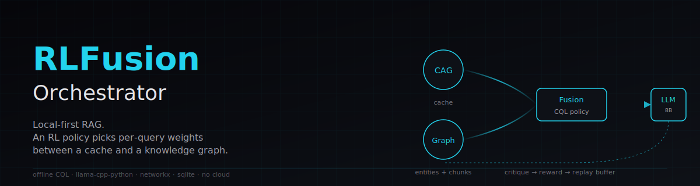

<p align="center">
  
</p>

# RLFusion Orchestrator

Local-first RAG chatbot. An offline RL policy picks per-query weights between an answer cache (CAG) and a knowledge graph (GraphRAG), and a separate critique LLM scores every response.

[](LICENSE)


## What it is

One Python process. Two retrieval paths (cache + entity graph). A CQL policy outputs `[w_cag, w_graph]` for the current query, the two contexts are fused by those weights, and Llama 3.1 8B generates. A critique LLM scores the response, the reward feeds the replay buffer, and high-reward turns get cached. No cloud calls.

## Quick start

```bash
export RLFUSION_ADMIN_KEY=$(python -c "import secrets; print(secrets.token_urlsafe(48))")
./scripts/init_db.sh
uvicorn backend.main:app --port 8000
```

```bash
cd frontend && npm install && npm run dev
```

UI at `http://localhost:5173`, API at `http://localhost:8000`.

Docker:

```bash
docker compose --profile gpu up    # or --profile cpu
```

## Docs

- [CLAUDE.md](CLAUDE.md): architecture, pipeline order, conventions
- [CSWR.md](CSWR.md): the chunk-scoring math
- [RELEASES.md](RELEASES.md): version history
- [SECURITY.md](SECURITY.md): admin auth, CORS, WS handshake, model integrity
- [CONTRIBUTING.md](CONTRIBUTING.md): dev setup, lint, tests

## License

MIT. See [LICENSE](LICENSE).
