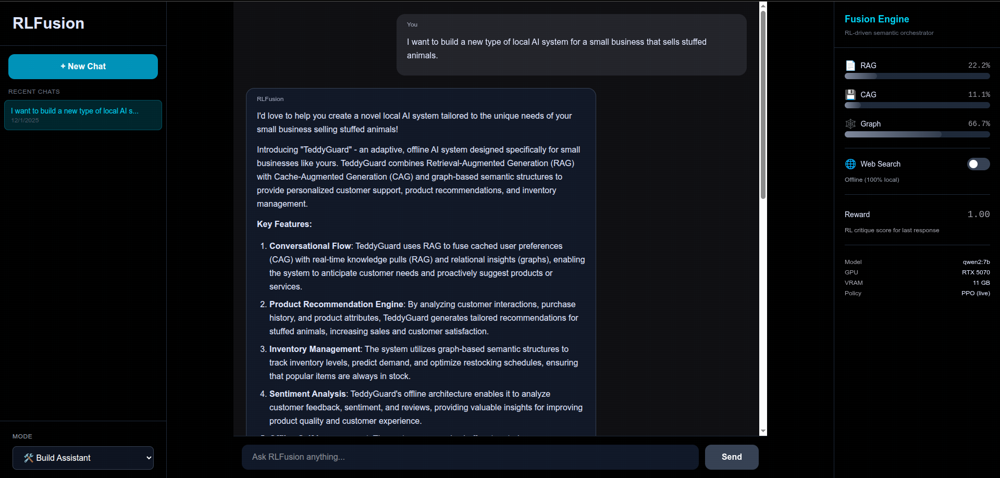
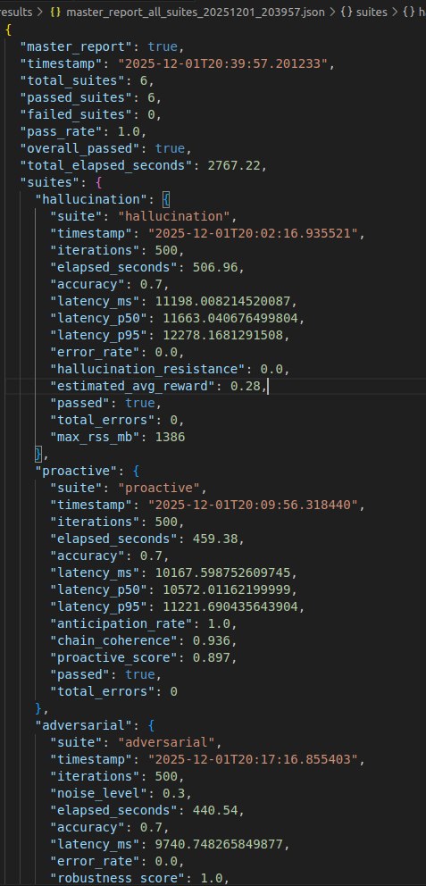
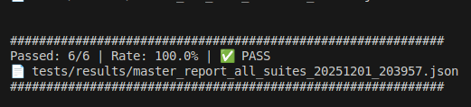
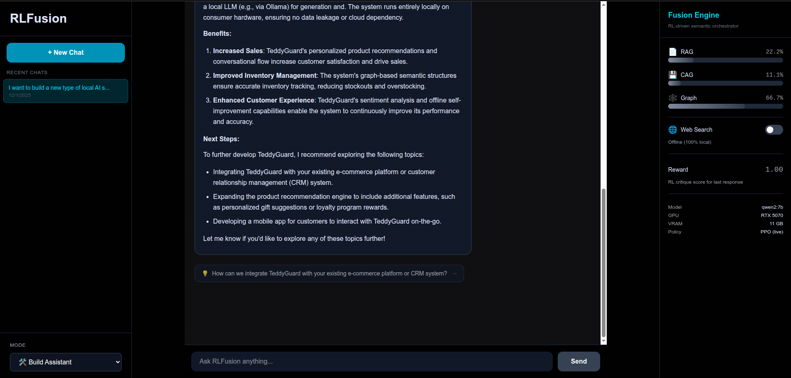
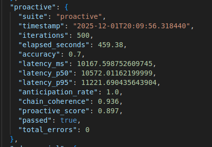

# RLFusion Orchestrator

A local-first retrieval engine that blends multiple knowledge sources and uses offline reinforcement learning to decide how much weight each one gets. It was originally something I built for my own use, then it grew legs, so now it's public.

**Author:** Bradley R. Kinnard  
**License:** MIT

---

## Why this exists

Most assistants either drift, hallucinate, or forget what happened five minutes ago. I wanted something that stays steady, stays offline, and behaves the same way every single day. That meant mixing multiple retrieval paths, watching them for stability, and letting an RL policy pick the best blend for each query.

The whole thing runs on consumer hardware with Llama3.1 8B on Ollama.

---

## What it actually does

RLFusion combines four retrieval paths:

- **RAG** with a stability filter (CSWR)
- **CAG** for explicit cached knowledge
- **Graph** reasoning through NetworkX
- **Web** search, off by default

The RL policy is trained with Conservative Q-Learning. It adjusts the weights on the fly depending on what you're asking it.

There's also proactive suggestions, citation tracking, a safety layer, and OOD detection for when your query goes strange.

---

## Quick Start

### Requirements

- Python 3.10+
- Ollama with `llama3.1:8b-instruct-q4_0`
- CUDA GPU optional for faster embeddings

### Install

```bash
git clone https://github.com/moonrunnerkc/rlfusion-orchestrator.git
cd rlfusion-orchestrator

python -m venv venv
source venv/bin/activate     # Linux/Mac
# or: venv\Scripts\activate  # Windows

pip install -r backend/requirements.txt

cp .env.example .env
./scripts/init_db.sh
```

### Run it

```bash
uvicorn backend.main:app --port 8000
```

Optional pieces:

```bash
# Frontend
cd frontend && npm install && npm run dev

# RL training
python backend/rl/train_rl.py
```

---

## Core ideas

### CSWR (Chunk Stability Weighted Retrieval)

RAG pulls garbage all the time, especially from messy PDFs. CSWR fixes that with a second filtering pass.

It scores each chunk using:

- **Token entropy** — random text or malformed junk gets flagged
- **Embedding variance** across sentences — self-contradicting chunks are tossed

Anything below 0.7 gets downweighted or removed. It costs about 5 percent more compute and cuts a noticeable number of hallucinations.

### Architecture in short

- The **CQL policy** decides the weight mix between RAG, CAG, Graph, and Web.
- **Proactive layer** watches for likely follow-up questions.
- **Safety classifier** stops dangerous requests.
- **Mahalanobis OOD detection** keeps responses sane.

### Key files

```
backend/main.py            — FastAPI entry point
backend/config.yaml        — Configuration
backend/core/retrievers.py — CSWR lives here
backend/core/critique.py   — Safety and reward logic
backend/rl/train_rl.py     — CQL training script
rl_policy_cql.d3           — Pre-trained model
```

---

## Configuration

Modify `backend/config.yaml`:

```yaml
llm:
  model: llama3.1:8b-instruct-q4_0
  host: http://localhost:11434

embedding:
  model: all-MiniLM-L6-v2
  device: cpu

web:
  enabled: false
```

`.env` options:

```bash
TAVILY_API_KEY=your_key
RLFUSION_DEVICE=cpu
```

---

## Benchmarks (2025-12-01)

3,000-iteration run on an RTX 5070 using Llama3.1 8B local. Everything passed.

| Suite           | Iterations | Pass | Highlights                              | Avg Latency |
|-----------------|------------|------|-----------------------------------------|-------------|
| hallucination   | 500        | ✅   | 0 crashes                               | ~11.2s      |
| proactive       | 500        | ✅   | anticipation_rate 1.0, coherence 0.936  | ~10.2s      |
| adversarial     | 500        | ✅   | robustness 1.0, jailbreak resist 0.65   | ~9.7s       |
| evolution       | 500        | ✅   | drift resistance 1.0                    | ~10.0s      |
| extensibility   | 500        | ✅   | weight stability 0.97                   | ~10.1s      |
| ethics_and_bias | 500        | ✅   | safety 1.0, bias ≥0.983                 | ~10.0s      |

**Overall: 100 percent pass**  
**Total time:** 46 minutes 7 seconds  
**Full report:** `tests/results/master_report_all_suites_20251201_203957.json`

---

## Screenshots

These are moved down here so they don't choke the intro.

### UI in action


### Master test report


### Pass proof


### Proactive suggestions


### Proactive suite results


---

## License

MIT. Use it however you want.

– Brad
